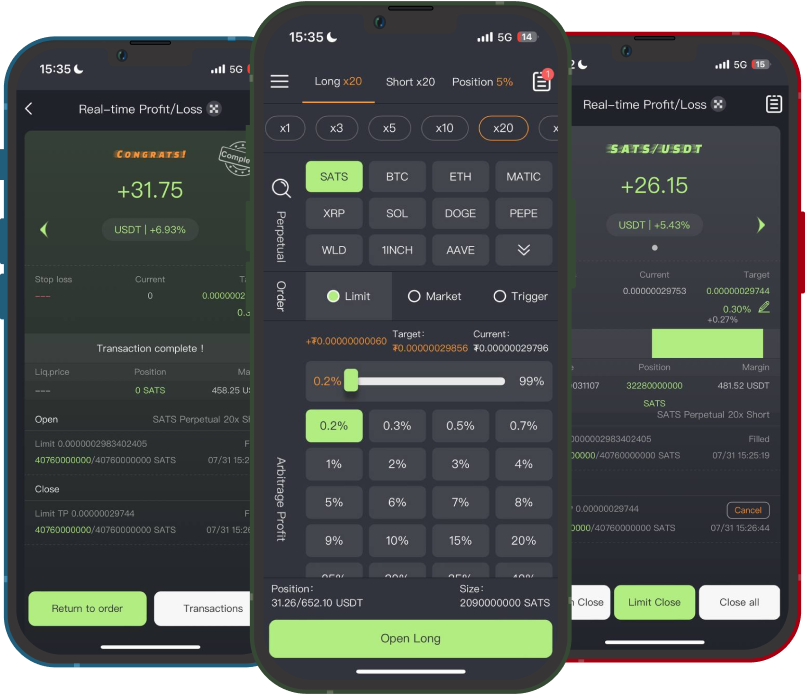

# 产品介绍

## Bitrader介绍

Bitrader App通过API连接OKX交易所进行加密货币交易，专为USDT币本位永续合约，高频度手动交易用户而推出。为用户带来“简洁、省心”的全新交易体验，Bitrader 的交易模式非常适合在极端、波动大的行情下使用，其核心功能是：在用户建仓后，程序会自动按用户的设定委托平仓（当行情价格触达委托价时即可自动平仓）。对追求低风险套利、高频度交易的用户来讲，Bitrader 提供了实用且友好的交互操作。

<figure><figcaption>
Bitrader交易主界面
</figcaption></figure>

## 适用理念

加密货币二级市场投资按“周期和交易频度风格”通常可分为：按“比特币大周期投资（通常1\~3年）、日线波段投资（周期通常几周至若干月）或分钟线至小时线的高频度交易”。Bitrader专为“分钟线至小时线的高频度交易”而推出，帮助追求低风险、稳健交易的用户实现快捷手动套利交易。

Bitrader App尤其适用于“高频、高杠杆”交易的用户。Bitrader 可以按用户设定的盈利百分比目标，自动委托平仓（在开仓成功后），对于追求0.3%-3%（低比例）盈利空间的合约交易用户极大的提升了套利能力。
