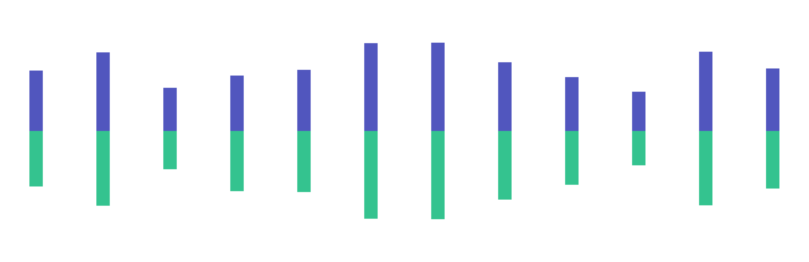

# 通证经济模式

## Bitrader平台收益


Bitrader平台的收益来自于交易所经纪商手续费收益。


## 回购

平台将90%收益（10%用于平台技术运营维持费用）用于回购Bitrader Token，回购的Token 100%用于社区\[下称社区总收益]，划拨给社区的收益由系统按约定比例销毁后分配给节点，详情见下文。

## 通缩

划拨给社区的\[社区总收益]，其中25%用于回购销毁Bitrader Token。

> 销毁时间：每月5日销毁上月回购的Bitrader Token。

## 分配

划拨给社区的\[社区总收益]，其中的75%由节点进行分配\[下称节点总入账]，由节点决定与旗下用户的分配比例关系。

## 用户收益

用户收益将由合作节点进行分配，基于\[节点总入账]基数按设定的比例进行分配（系统按节点设置自动分配）。

<figure><figcaption></figcaption></figure>
